# Coffee26n V5.0

Coffee26n V5.0 是本仓库面向咖啡叶病害检测的新一代大版本，基于 Ultralytics YOLO26n 构建。本次发布新增完整的 Coffee26n 结构消融链、CoffeeLoss、病斑保护型 BgMix、数据与源码锁、高算训练入口，以及用于生成该实验包的全部指导文档。

V5 实验包独立放在 `coffee26n_experiment/`。模型解析器、自定义模块、损失函数和训练改动全部位于 `coffee26n_experiment/local_ultralytics/`，运行时不会覆盖仓库根目录的原生 `ultralytics/`。

## 版本状态

| 版本 | 主要内容 | 状态 |
|---|---|---|
| `v1.0` | 初始可复现咖啡病害检测版本 | 保留 |
| `v2.0` | EdgeLite 与 WIoU/ProgLoss 隔离实验 | 保留 |
| `v3.0` / `v3.1` | P5Slim-512 与 Android 部署资料 | 保留 |
| `v4.0` | 不含数据集的 Coffee V4 训练代码 | 上一大版本 |
| `v5.0` | Coffee26n 结构、CoffeeLoss、BgMix 与可审计高算工作流 | 当前大版本 |

## V5.0 最新改动

| 改动 | 目的 | 作用 | Flow | 插入位置 |
|---|---|---|---|---|
| `DetailBlock` | 保留小病斑、细线边界和晕圈纹理 | 在不替换预训练 P3 主路径的前提下增加有界细节修正 | reduce -> spot/line/halo 三支路 -> concat -> 1x1 mix -> signed gated residual | P3 颈部 `T3_base` 之后、P3 Detect 与第一次自底向上下采样之前 |
| `MixDown` | 降低特征图下采样时的混叠 | 保留原生 stride-2 卷积，再加入小幅可学习低频补偿 | native 3x3/s2 + avg-pool -> 1x1 -> sigmoid-gated sum | `core` 及后续结构的 neck P3->P4、P4->P5；`x3/x5/x7` 另测 backbone 插入点 |
| `MidBlock` | 加强 P4 中尺度病斑上下文 | 用部分通道获取局部与因式分解 9x9 感受野 | split -> 3x3 local / 1x9+9x1 large -> concat -> 1x1 -> signed gated residual | neck `O4` 之后、P4 Detect 与 P4->P5 下采样之前 |
| `ContextBlock` | 为大面积或弥散病斑补充广域与全局上下文 | 自适应选择局部、13x13 因式分解大核和全局分支 | three branches -> softmax selector -> 1x1 -> sigmoid-gated residual | backbone `C2PSA/B5` 之后、`ResBridge` 与自顶向下 neck 之前 |
| `ResBridge` | 协调 P3 浅层细节与 P5 深层语义 | 通过角色注意力将浅层病斑细节注入深层上下文 | P3 reduce/detail/down x4 + P5 local/dilated -> role attention -> projection -> gated P5 residual | 读取 B3/P3 与 B5/P5，输出替代最终 P5 融合使用的深层 skip |
| `CoffeeE2ELoss` | 让咖啡专用目标覆盖完整 YOLO26 E2E 检测头 | one-to-many 与 one-to-one 两个分支使用同步 ramp | native assignment -> WIoU/normalized L1 + BCE/TailBCE + optional PairMargin | 包内 `DetectionModel.init_criterion()`；Detect 结构本身不改 |
| GPU `BgMix` | 降低模型对背景的依赖，同时保护病斑像素 | 只对扩张 GT 框外区域执行模糊、去饱和或对比度变换 | batch transfer -> preserve mask -> background transform -> exact protected merge | 包内 trainer 的 `preprocess_batch()`，几何增强之后、模型前向之前 |
| 数据与源码锁 | 让每次实验可比较、可追溯 | 数据变化、源码漂移、未知配置和重复输出目录均 fail-closed；源码清单使用可移植相对路径 | explicit YAML -> label/split checks -> data lock -> resolved config -> run manifest | 训练开始前及每个输出目录内 |

## Full 结构流程

```mermaid
flowchart LR
    I["输入图像"] --> B3["Backbone B3 / P3, stride 8"]
    B3 --> B4["Backbone B4 / P4, stride 16"]
    B4 --> B5["Backbone C2PSA / P5, stride 32"]
    B5 --> C["ContextBlock"]
    B3 --> R["ResBridge detail path"]
    C --> R
    R --> T4["Top-down T4"]
    T4 --> T3["T3_base"]
    T3 --> D["DetailBlock -> P3"]
    D --> M1["MixDown"]
    M1 --> O4["O4"]
    O4 --> M["MidBlock -> P4"]
    M --> M2["MixDown"]
    M2 --> O5["O5 -> P5"]
    D --> H["Detect P3/P4/P5"]
    M --> H
    O5 --> H
```



Detect 始终只接收 P3、P4、P5 三个尺度，stride 固定为 `[8, 16, 32]`。V5 没有增加 P2 Detect 头。

## 结构变体工作流

V5 提供 26 个 CLI 变体 ID，对应 18 份独立 YAML。其中 7 个名称构成发布里程碑路线：

| 里程碑 | 新增行为 | Detect 输入层 |
|---|---|---|
| `native` | 原生 YOLO26n 对照 | `[16, 19, 22]` |
| `b0` | 包内 B0 流程对照 | `[16, 19, 22]` |
| `r3` | 完整 residual + role-attention `ResBridge` | `[17, 20, 23]` |
| `core` | `r3 + DetailBlock + 两个 neck MixDown` | `[18, 21, 24]` |
| `p4mid` | `core + MidBlock` | `[18, 22, 25]` |
| `p5lk13` | `core + ContextBlock(k=13)` | `[19, 22, 25]` |
| `full` | `core + MidBlock + ContextBlock(k=13)` | `[19, 23, 26]` |

完整消融链见 `coffee26n_experiment/README.md`，包括 `r0-r3` 桥接 2x2 象限、`c1-c3` 下采样对比、`d1` bounded ELTEB、`x3/x5/x7` backbone 插入位置，以及 `k0-k4` 累积上下文路线。

## CoffeeLoss flow

```text
YOLO26 E2E predictions
  +-- one-to-many assignment (top-k 10) -> CoffeeLoss
  +-- one-to-one assignment  (top-k  1) -> CoffeeLoss

CoffeeLoss
  +-- box: CIoU -> bounded WIoU ramp
  +-- 第三个回归项: reg_max=1 时为 normalized L1，否则保持 native DFL
  +-- class: BCE -> legacy progressive weights 或 TailBCE
  +-- optional: quality-gated PairMargin
```

| Loss | 分类扩展 | PairMargin |
|---|---|---|
| `native` | 原生 YOLO26 loss | 关闭 |
| `coffee_l1` | 旧版 progressive 正类权重 | 关闭 |
| `coffee_l2` | TailBCE，cap 1.8 | 关闭 |
| `coffee_l3` | TailBCE，cap 2.4 | 关闭 |
| `coffee_l4` | TailBCE，cap 2.4 | 开启 |

## 仓库目录

| 路径 | 内容 |
|---|---|
| `coffee26n_experiment/` | 完整 V5 可执行实验包 |
| `coffee26n_experiment/configs/models/` | 对照、消融和最终结构 YAML |
| `coffee26n_experiment/configs/profiles/` | 数据集无关与咖啡专用 loss/BgMix profile |
| `coffee26n_experiment/local_ultralytics/` | 隔离的 Ultralytics 8.4.43 修改运行时 |
| `coffee26n_experiment/loss/` | CoffeeLoss、WIoU、TailBCE、PairMargin |
| `coffee26n_experiment/augmentations/` | 保框 CPU/GPU BgMix |
| `coffee26n_experiment/tests/` | 结构、损失、增强、清单和训练入口测试 |
| `docs/coffee26n_v5/` | 全部生成 prompt、结构指导和优化方案 |

Coffee3000、其他真实数据集、`runs/`、缓存和下载的 HPC 结果均不提交。仅保留可复现测试所需的小型 fixture 图片和包内 Ultralytics 默认资产。`coffee26n_experiment/yolo26n.pt` 是唯一提交的 checkpoint，只用于官方初始化权重迁移，不是 Coffee3000 训练结果。

## 第一次高算训练

第一次 V5 训练严格只跑一次：

```text
dataset=coffee3000        variant=full
profile=auto_full        loss=coffee_l4
batch=96                 seed=0
imgsz=960                epochs=300
```

默认集群路径：

```text
/public/home/2024505440209/ultralytics-8.4.43/coffee3000/coffee3000.yaml
```

在仓库根目录提交：

```bash
sbatch coffee26n_experiment/submit_coffee26n.slurm
```

如高算上的实际位置不同，可通过环境变量覆盖，不需要修改源码：

```bash
DATA_YAML=/actual/path/coffee3000.yaml \
WEIGHTS=/actual/path/yolo26n.pt \
sbatch coffee26n_experiment/submit_coffee26n.slurm
```

Coffee3000 是计划中的第一次数据集，不代表本版本已经验证其训练结果。任务必须先解析高算上的真实 YAML，确认 `nc/names`、标签与 split 完整性，并生成新的 data lock；文件缺失或配置不兼容时会在优化开始前失败。

## 本地验证

```powershell
$env:PYTHONDONTWRITEBYTECODE = "1"
python -m pytest -p no:cacheprovider coffee26n_experiment/tests coffee26n_experiment/loss coffee26n_experiment/augmentations -q
python coffee26n_experiment/verify_structure.py --matrix --weights none --output "$env:TEMP/coffee26n_v5_matrix.json"
```

发布门禁会对所有 26 个 ID 在 `nc=1,6,80`、`imgsz=640,960` 下检查有限前向、P3/P4/P5 stride、动态 YOLO26s 参数上限、包内 import 隔离和 source manifest。

V5.0 实测验证结果：

| 检查 | 结果 |
|---|---:|
| 单元与集成测试 | `48 passed, 1 skipped` |
| 结构矩阵 | `156/156 passed` |
| stride 失败 | `0` |
| 有限前向失败 | `0` |
| 硬参数预算失败 | `0` |
| source manifest | 通过 |
| Python compileall | 通过 |
| 两个 Slurm 脚本语法 | 通过 |

## 已知限制

- V5 是结构与运行包验证通过的版本；在高算真实 Coffee3000 数据和训练结果完成审计前，不声明 Coffee3000 精度。
- 首次协议按要求只使用一个固定种子，因此不是多种子统计比较。
- 结构收益必须在同一 data lock、优化器、增强、epoch 和评估设置下重新训练后比较，不能把 V1-V4 历史结果直接当作 V5 受控消融。
- 本地 Windows 一次 1 epoch smoke 曾在优化器初始化后无 Python traceback 退出，该事件不算训练成功。
- 本版本不包含真实数据集、Coffee3000 训练权重、P2 Detect、蒸馏结果、PTQ/QAT 结果或部署延迟结论。

## 生成指导与来源

完整生成指导已上传到 `docs/coffee26n_v5/`：

- `coffee26n_codegen_multiagent_prompt.md`
- `yolo26n_module_architecture_guide.md`
- `coffee26n_optimization_plan.md`

模块契约、全部 26 个变体 ID、数据锁工作流和运行产物详见 `coffee26n_experiment/README.md`。
