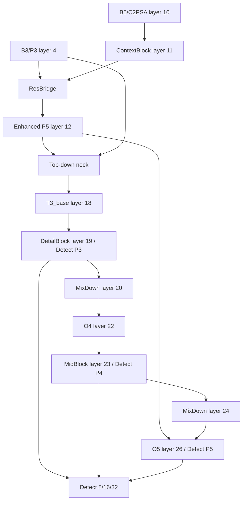
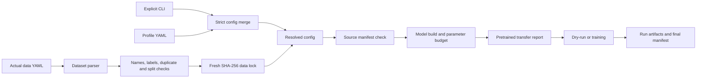

# Coffee26n V5 experiment package

This directory is the self-contained Coffee26n V5 architecture and loss experiment for Ultralytics 8.4.43. All modified runtime code is isolated under `local_ultralytics/`; the repository root `ultralytics/` remains a reference implementation and is not patched by the package.

The production candidate is:

```text
full + auto_full + coffee_l4 + BgMix(auto)
batch=96 + seed=0 + one run
first target dataset=Coffee3000
```

Coffee3000 is not bundled and is not claimed as validated. The first cluster job must inspect the actual YAML, names, labels, splits and data lock before training.

## Safety and reproducibility contract

- `--data` is explicit. The runtime does not silently choose a dataset.
- Missing weights fail closed. The runtime never downloads a checkpoint implicitly.
- Unknown profile keys, class mismatches and invalid PairMargin pairs fail closed.
- Detect must remain P3/P4/P5 with stride `[8, 16, 32]`.
- Every variant must remain under the dynamically built same-`nc` YOLO26s hard parameter limit.
- A non-empty output directory is rejected to prevent accidental overwrite.
- Every run records resolved configuration, dataset lock, source/model snapshot, transfer coverage, parameter budget and final status.
- `source_manifest.json` must be regenerated after every package source or documentation change; it records portable repository-relative paths rather than local machine paths.

## Package layout

| Path | Responsibility |
|---|---|
| `train_coffee26n.py` | Single training/dry-run entrypoint and run artifact writer |
| `verify_structure.py` | Offline structure, stride, finite-forward, transfer and budget verifier |
| `submit_coffee26n.slurm` | Canonical one-job Coffee3000 submission |
| `slurm/train_coffee26n.slurm` | Relocatable wrapper for the canonical submission |
| `config.py` | Strict profile merge, variant map and runtime resolution |
| `dataset.py` | YAML/name/label/split checks and data-lock creation |
| `model_utils.py` | Isolated imports, model building, dynamic Detect discovery, budgets and weight transfer |
| `manifest.py` | Stable SHA-256 source manifest generation and verification |
| `configs/models/` | 18 distinct model YAMLs exposed through 26 CLI IDs |
| `configs/profiles/` | `generic`, `coffee_ant6` and dataset-adaptive `auto_full` profiles |
| `local_ultralytics/` | Package-local Ultralytics parser, modules, trainer and loss hooks |
| `loss/` | CoffeeLoss, WIoU, TailBCE and PairMargin implementation |
| `augmentations/` | Box-preserving BgMix implementation |
| `dataset_recipes/` | Audited strict-five dataset recipe; retained for provenance, not the V5 Coffee3000 default |
| `tests/` | Unit and integration checks for all release contracts |

## Full model topology

The final `coffee26n_full.yaml` layer flow is:

| Layer | Tensor role | Operation | Output use |
|---:|---|---|---|
| 0-4 | Backbone P1 -> B3/P3 | Native Conv/C3k2 | Layer 4 is the stride-8 detail source for ResBridge and top-down P3 skip |
| 5-6 | Backbone B4/P4 | Native Conv/C3k2 | Layer 6 is the stride-16 top-down skip |
| 7-10 | Backbone B5/P5 | Conv/C3k2/SPPF/C2PSA | Layer 10 is the native deep semantic source |
| 11 | Context P5 | `ContextBlock(k=13)` | Broad local/global context before cross-scale fusion |
| 12 | Enhanced P5 | `ResBridge([layer 4, layer 11])` | Deep skip for final bottom-up P5 fusion |
| 13-18 | Top-down neck | Upsample/Concat/C3k2 | Layer 18 is `T3_base` |
| 19 | Detect P3 | `DetailBlock` | First Detect source, stride 8 |
| 20-22 | Bottom-up P4 | `MixDown`/Concat/C3k2 | Layer 22 is native `O4` |
| 23 | Detect P4 | `MidBlock(k=9)` | Second Detect source, stride 16 |
| 24-26 | Bottom-up P5 | `MixDown`/Concat/C3k2 | Layer 26 is third Detect source, stride 32 |
| 27 | Detection head | `Detect([19, 23, 26])` | End-to-end P3/P4/P5 predictions |



## Module contracts

### DetailBlock

Purpose: refine small coffee spots, narrow lesion lines and boundary halos late enough that the native backbone remains reusable.

Insertion: after neck `T3_base`, before the P3 Detect source and first bottom-up downsample. It is present in `core`, `p4mid`, `p5lk7`, `p5lk13`, `full` and the `x*` ablations.

Tensor flow:

```text
x
+-- shortcut/1x1 projection ------------------------------+
+-- 1x1 reduce -> depthwise 3x3 spot ---------------------|
               -> depthwise 1x5 -> 5x1 line -------------|-> concat -> 1x1 mix -> delta
               -> depthwise dilated 3x3 halo -------------|

output = shortcut(x) + 0.25 * tanh(gate_raw) * delta
```

Effect: the signed gate initializes at zero, so the new branch starts as an identity-compatible residual and can learn either positive or negative correction with magnitude bounded by 0.25.

### MixDown

Purpose: preserve the stable native stride-2 path while adding a small anti-aliasing correction.

Insertion: replaces both neck downsamplers P3->P4 and P4->P5 in `c3/core` and later variants. `x3`, `x5` and `x7` separately replace one backbone downsampler to test the insertion location.

Tensor flow:

```text
x -> native Conv(3x3, stride 2) -------------------------- base
x -> AvgPool(2x2, stride 2, ceil) -> Conv(1x1) ---------- low

output = base + sigmoid(gate=-4) * low
```

Effect: the initialized low-frequency contribution is small while the `base` submodule remains directly mappable from native pretrained stride-2 convolutions.

### MidBlock

Purpose: improve medium-scale lesion context without running a large kernel over all P4 channels.

Insertion: after neck `O4`, before P4 Detect and the second `MixDown`; used by `p4mid/full`.

Tensor flow:

```text
base(x) -> split channels
  +-- half A -> depthwise 3x3 local
  +-- half B -> depthwise 1x9 -> 9x1 large context
concat -> 1x1 mix -> delta

output = base + 0.20 * tanh(gate_raw) * delta
```

Effect: local and longer-range evidence are mixed with a zero-initialized signed residual bounded by 0.20.

### ContextBlock

Purpose: supply deep P5 features with large and global context for diffuse disease regions and broad leaves.

Insertion: directly after backbone `C2PSA/B5`, before ResBridge and the top-down neck; `p5lk7` uses kernel 7 and `p5lk13/full` use kernel 13.

Tensor flow:

```text
base
  +-- depthwise 3x3 local
  +-- depthwise 1xK -> Kx1 large kernel
  +-- global average pool -> 1x1 -> broadcast
concat branches -> global selector -> softmax weights -> weighted sum -> 1x1

output = base + sigmoid(gate=-3) * context
```

Effect: the selector chooses the useful receptive-field role per sample while the residual gate keeps initialization close to the pretrained P5 path.

### ResBridge

Purpose: inject shallow lesion detail into the deep semantic path without adding a fourth Detect scale.

Insertion: reads backbone B3/P3 at stride 8 and native/context-enhanced P5 at stride 32. Its output replaces the original P5 skip used by the final bottom-up neck concat.

Tensor flow:

```text
P3 -> 1x1 reduce -> DetailBlock -> Conv/s2 -> Conv/s2 -------- detail at P5 scale
P5 -> 1x1 reduce -> [depthwise 5x5 + dilated 3x3] -> 1x1 ---- semantic
detail + semantic -> role-aware attention -> 1x1 projection --- delta

residual mode: output = P5 + sigmoid(gate=-3) * delta
non-residual mode: output = delta
```

Effect: `r0-r3` pre-register the residual/attention 2x2 ablation so the fusion mechanism can be measured without changing the surrounding graph.

## Variant and ablation map

### Controls and ResBridge quadrants

| CLI ID | YAML/behavior | Purpose |
|---|---|---|
| `native` | Native control graph | Reference for parameter budget and behavior |
| `b0` | Package-local B0 control | Experiment-pipeline control with the same Detect sources |
| `r0` | ResBridge: residual off, role attention off | Pure projected fusion |
| `r1` | Residual on, role attention off | Measure residual contribution |
| `r2` | Residual off, role attention on | Measure role attention contribution |
| `r3` | Residual on, role attention on | Complete bridge |

### Downsampler and block selection

| CLI ID | Added behavior | Purpose |
|---|---|---|
| `c0` | Alias of `r3` | Component-stage control |
| `c1` | `r3 + LDSConv` neck downsamplers | Compare learned lightweight downsampling |
| `c2` | `r3 + SCDown` neck downsamplers | Compare separable downsampling |
| `c3` | `r3 + MixDown` neck downsamplers | Select the gated native-compatible path |
| `d0` | Alias of `c3` | Detail-stage control |
| `d1` | BoundedELTEB at backbone B3 + `c3` | Compare bounded early detail enhancement |
| `d2` | Alias of `core` | Selected late-detail design |
| `core` | `r3 + DetailBlock + two neck MixDown` | Core V5 structure |

### Insertion and context ladder

| CLI ID | Added behavior | Purpose |
|---|---|---|
| `x3` | Core plus backbone P3 downsample `MixDown` | Test early backbone insertion |
| `x5` | Core plus backbone P4 downsample `MixDown` | Test middle backbone insertion |
| `x7` | Core plus backbone P5 downsample `MixDown` | Test deep backbone insertion |
| `k0` | Alias of `core` | Context-stage control |
| `k1` / `p4mid` | Core plus P4 `MidBlock(k=9)` | Test medium-scale context |
| `k2` / `p5lk7` | Core plus P5 `ContextBlock(k=7)` | Test smaller deep context |
| `k3` / `p5lk13` | Core plus P5 `ContextBlock(k=13)` | Test selected deep context |
| `k4` / `full` | P4 MidBlock plus P5 ContextBlock(k=13) | Final cumulative structure |

Seven milestone names are used in release summaries: `native`, `b0`, `r3`, `core`, `p4mid`, `p5lk13`, `full`. The verifier and tests cover all 26 registered CLI IDs.

## CoffeeLoss

The loss hook is package-local in `local_ultralytics/ultralytics/nn/tasks.py`. Native loss remains available. For YOLO26 end-to-end mode, `CoffeeE2ELoss` constructs two CoffeeLoss instances:

```text
one-to-many branch -> TAL top-k 10 -> CoffeeLoss
one-to-one branch  -> TAL top-k  1 -> CoffeeLoss
epoch progress --------------------> synchronized ramps in both branches
```

Box loss:

- CIoU is the stable base.
- WIoU is blended by an independent smooth ramp and uses detached bounded focus statistics.
- `reg_max=1` uses normalized L1 as the third box term.
- `reg_max>1` keeps native DFL behavior.

Classification loss:

| Name | Positive-class treatment | Pair constraint |
|---|---|---|
| `native` | Native BCE | None |
| `coffee_l1` | Legacy progressive weighting | None |
| `coffee_l2` | TailBCE cap 1.8 | None |
| `coffee_l3` | TailBCE cap 2.4 | None |
| `coffee_l4` | TailBCE cap 2.4 | Quality-gated PairMargin |

`auto_full` reads current train labels, derives class counts, and creates a minority-to-dominant pair only when the rival count is at least 1.25x the true class. Balanced or single-class data therefore receives no arbitrary semantic pair.

## BgMix

BgMix is a training-only background perturbation with exact GT-region preservation.

```text
preprocessed GPU batch
  -> read batch_idx + normalized boxes
  -> expand each GT box by profile ratio
  -> union boxes into per-image preserve mask
  -> choose blur / desaturate / contrast
  -> transform only outside preserve mask
  -> assert protected pixels are bitwise unchanged
  -> model forward
```

The production profile uses `p=0.25`, expansion `0.02`, blur kernel `21`, empty-label policy `skip`, and disables BgMix after epoch 150. Runtime counts and preserve ratios are written to `bgmix_monitor.csv`.

## Configuration and data-lock workflow



Profile precedence is: strict generic defaults -> selected profile -> explicit CLI values. Unknown keys are rejected instead of ignored.

## First Coffee3000 high-compute run

The canonical V5 submission is one run:

```text
variant=full              profile=auto_full
loss=coffee_l4            bgmix=auto (p=0.25)
seed=0                    batch=96
imgsz=960                 epochs=300
device=0                  deterministic=true
```

Default expected cluster path:

```text
/public/home/2024505440209/ultralytics-8.4.43/coffee3000/coffee3000.yaml
```

Submit:

```bash
sbatch coffee26n_experiment/submit_coffee26n.slurm
```

Override locations:

```bash
DATA_YAML=/absolute/path/to/coffee3000.yaml \
WEIGHTS=/absolute/path/to/yolo26n.pt \
sbatch coffee26n_experiment/submit_coffee26n.slurm
```

The Slurm job verifies PyTorch/CUDA, package-local imports, the actual dataset YAML, structure, parameter budget and weights before training. `train_coffee26n.py` then writes the fresh data lock. There is no seed loop, variant loop or retry loop.

## Local checks

Run from the repository root:

```powershell
$env:PYTHONDONTWRITEBYTECODE = "1"
python -m pytest -p no:cacheprovider coffee26n_experiment/tests coffee26n_experiment/loss coffee26n_experiment/augmentations -q
python coffee26n_experiment/verify_structure.py --matrix --weights none --output "$env:TEMP/coffee26n_v5_matrix.json"
python coffee26n_experiment/train_coffee26n.py `
  --data /path/to/actual/data.yaml `
  --variant full --profile auto_full --loss coffee_l4 --bgmix auto `
  --imgsz 960 --batch 96 --seed 0 --weights coffee26n_experiment/yolo26n.pt --dry-run
```

The matrix covers:

```text
26 registered IDs x 3 class counts (1, 6, 80) x 2 image sizes (640, 960)
= 156 structure/forward/budget cases
```

V5.0 validation result:

| Check | Result |
|---|---:|
| Pytest | `48 passed, 1 skipped` |
| Structure/forward/budget matrix | `156/156 passed` |
| P3/P4/P5 stride failures | `0` |
| Finite-forward failures | `0` |
| Hard parameter-budget failures | `0` |

## Run artifacts

Each new output directory contains, as applicable:

- `resolved_config.yaml`
- `data_lock/` and lock identifier
- `source_manifest.json`
- model YAML/source snapshots
- `param_budget.json`
- `pretrain_transfer.json`
- `run_manifest.json`
- loss, bridge-attention, BgMix and validation monitoring CSV files
- native Ultralytics training artifacts

## Limitations

- Coffee3000 remains unvalidated until the real high-compute YAML and dataset contents pass the preflight.
- This release does not claim a Coffee3000 accuracy improvement.
- One fixed seed is useful for the requested first run but does not establish statistical significance.
- V5 architecture comparisons require the same data lock and identical training/evaluation settings.
- A previous local Windows one-epoch smoke process stopped after optimizer initialization without a traceback; it is recorded as an unresolved local-runtime interruption, not a successful run.
- No P2 Detect head, teacher-student distillation route, PTQ/QAT result or deployment latency claim is included in V5.
